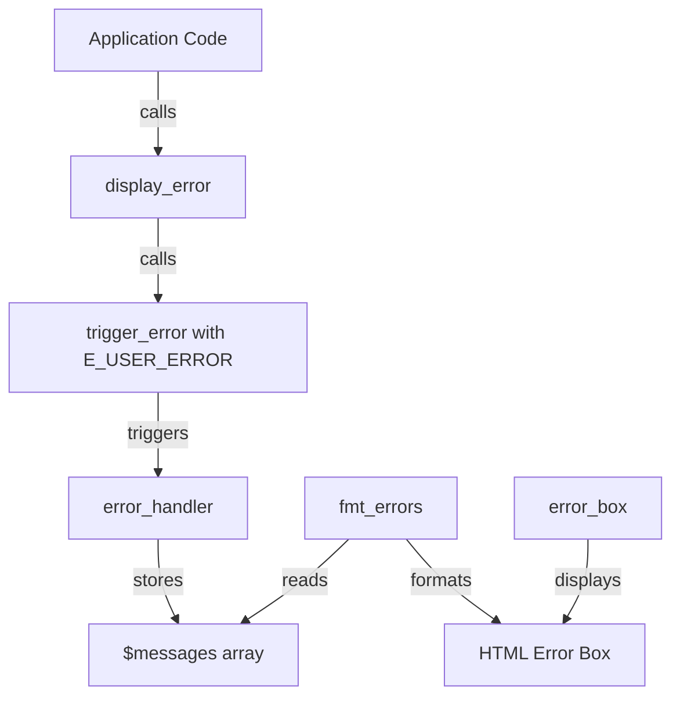

# PHP 8.4 E_USER_ERROR Deprecation Fix Plan

## Status: ✅ IMPLEMENTED

## Problem Summary

PHP 8.4 deprecates passing `E_USER_ERROR` to `trigger_error()`. The deprecation message states:
> Passing E_USER_ERROR to trigger_error() is deprecated since 8.4, throw an exception or call exit with a string message instead

This affects FrontAccounting's error handling mechanism which relies on `trigger_error()` with `E_USER_ERROR`, `E_USER_WARNING`, and `E_USER_NOTICE` constants.

## Affected Files

### Primary Files Requiring Changes

| File | Line | Current Code | Impact |
|------|------|--------------|--------|
| [`ui_msgs.inc`](../../includes/ui/ui_msgs.inc:14) | 14 | `trigger_error($msg, E_USER_ERROR)` | **Critical** - Used by 300+ `display_error()` calls |
| [`ui_msgs.inc`](../../includes/ui/ui_msgs.inc:19) | 19 | `trigger_error($msg, E_USER_NOTICE)` | Used for notifications |
| [`ui_msgs.inc`](../../includes/ui/ui_msgs.inc:24) | 24 | `trigger_error($msg, E_USER_WARNING)` | Used for warnings |
| [`errors.inc`](../../includes/errors.inc:208) | 208 | `trigger_error($str, E_USER_ERROR)` | Database errors |
| [`errors.inc`](../../includes/errors.inc:210) | 210 | `trigger_error($str, E_USER_WARNING)` | Database warnings |
| [`JsHttpRequest.php`](../../includes/JsHttpRequest.php:117) | 117 | `trigger_error(..., E_USER_ERROR)` | AJAX library |
| [`Mobile_Detect.php`](../../includes/Mobile_Detect.php:207) | 207 | `trigger_error(..., E_USER_WARNING)` | Mobile detection library |

### Supporting Files (may need review)

| File | Purpose |
|------|---------|
| [`errors.inc`](../../includes/errors.inc) | Error handler, message formatting, and display functions |

## Current Architecture



The current flow:
1. Application code calls `display_error($msg)`
2. `display_error()` calls `trigger_error($msg, E_USER_ERROR)`
3. Custom `error_handler()` in [`errors.inc`](../../includes/errors.inc:59) intercepts the error
4. Error is stored in global `$messages` array
5. [`fmt_errors()`](../../includes/errors.inc:103) formats messages for display
6. [`error_box()`](../../includes/errors.inc:149) renders the error box in the UI

## Solution Options

### Option 1: Direct Message Collection (Recommended)

Modify `display_error()`, `display_notification()`, and `display_warning()` to directly add messages to the `$messages` array, bypassing `trigger_error()` entirely.

**Pros:**
- Clean solution that maintains backward compatibility
- No behavior changes for application code
- Minimal code changes required
- No exception handling overhead

**Cons:**
- Requires modifying core functions
- Need to handle the error type constants properly

**Implementation:**

```php
// In ui_msgs.inc
function display_error($msg, $center=true)
{
    global $messages, $SysPrefs;
    
    $bt = isset($SysPrefs) && $SysPrefs->go_debug > 1 ? get_backtrace(true, 1) : '';
    $messages[] = array(E_USER_ERROR, $msg, null, null, $bt);
}
```

### Option 2: Exception-Based Approach

Replace `trigger_error()` with custom exceptions and catch them at the application level.

**Pros:**
- Modern PHP best practice
- Better control flow management
- Stack trace preservation

**Cons:**
- Major architectural change
- Requires try-catch blocks throughout the codebase
- Could break existing error handling flow
- More invasive changes

### Option 3: Use E_USER_WARNING for Errors

Downgrade `E_USER_ERROR` to `E_USER_WARNING` in `display_error()`.

**Pros:**
- Minimal code change

**Cons:**
- Changes error semantics
- Errors won't be treated as critically
- May affect error display styling/logic

### Option 4: PHP Version Conditional

Use `trigger_error()` for PHP < 8.4 and direct message collection for PHP >= 8.4.

**Pros:**
- Backward compatible with older PHP versions

**Cons:**
- Maintains deprecated code path
- More complex maintenance

## Recommended Solution: Option 1 with Version Check

Implement Option 1 with a PHP version check for maximum compatibility:

```php
// In ui_msgs.inc
function display_error($msg, $center=true)
{
    global $messages, $SysPrefs;
    
    $bt = isset($SysPrefs) && $SysPrefs->go_debug > 1 ? get_backtrace(true, 1) : '';
    
    if (PHP_VERSION_ID >= 80400) {
        // Direct message collection for PHP 8.4+
        $messages[] = array(E_USER_ERROR, $msg, null, null, $bt);
    } else {
        // Legacy approach for older PHP versions
        trigger_error($msg, E_USER_ERROR);
    }
}
```

## Implementation Steps

### Step 1: Modify ui_msgs.inc

1. Update [`display_error()`](../../includes/ui/ui_msgs.inc:12) to use direct message collection
2. Update [`display_notification()`](../../includes/ui/ui_msgs.inc:17) similarly
3. Update [`display_warning()`](../../includes/ui/ui_msgs.inc:22) similarly

### Step 2: Modify errors.inc

1. Update [`display_db_error()`](../../includes/errors.inc:178) to use direct message collection

### Step 3: Handle Third-Party Libraries

1. **JsHttpRequest.php** - This is a third-party library. Options:
   - Update to a newer version if available
   - Patch locally with version check
   - Suppress deprecation warnings for this file

2. **Mobile_Detect.php** - Third-party library. Same options as above.

### Step 4: Testing

1. Test error display functionality
2. Test warning display functionality  
3. Test notification display functionality
4. Test database error handling
5. Test AJAX error handling
6. Verify error logging still works

## Files to Modify

```
includes/ui/ui_msgs.inc     - Primary changes
includes/errors.inc         - Database error handling
includes/JsHttpRequest.php  - Third-party library (optional)
includes/Mobile_Detect.php  - Third-party library (optional)
```

## Risk Assessment

| Risk | Likelihood | Impact | Mitigation |
|------|------------|--------|------------|
| Breaking existing error display | Low | High | Thorough testing |
| Third-party library issues | Medium | Low | Version check or suppression |
| PHP version compatibility | Low | Medium | Version conditional code |

## Notes

- The `E_USER_ERROR`, `E_USER_WARNING`, and `E_USER_NOTICE` constants are NOT deprecated - only passing `E_USER_ERROR` to `trigger_error()` is deprecated
- The custom error handler in [`error_handler()`](../../includes/errors.inc:59) can remain unchanged as it handles all error types
- The message formatting in [`fmt_errors()`](../../includes/errors.inc:103) uses these constants for CSS class selection and can remain unchanged
